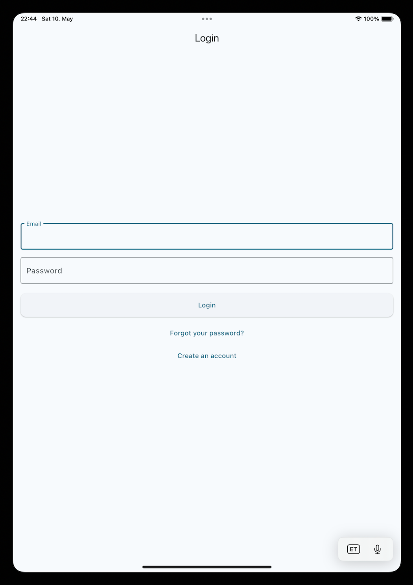
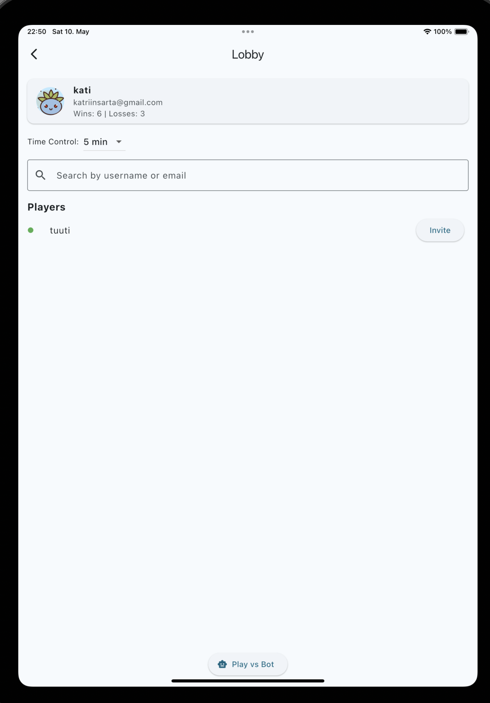
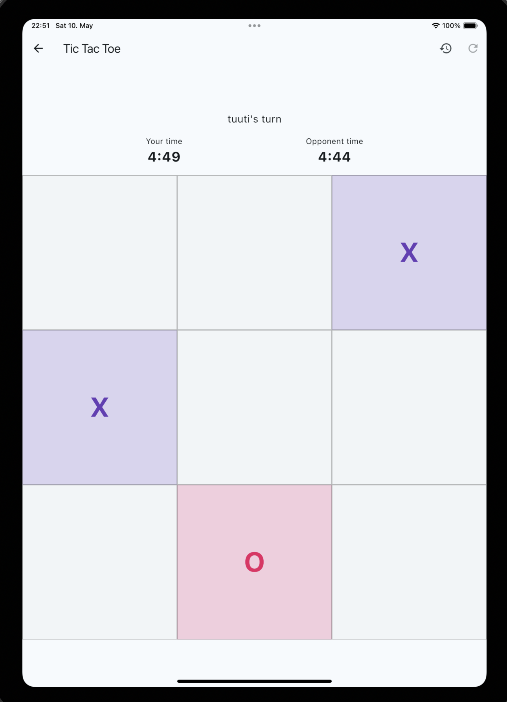

# 🎮 Join The Fun – Flutter Multiplayer Tic-Tac-Toe

Join The Fun is a real-time multiplayer Tic-Tac-Toe game built in Flutter, featuring user authentication, live invites, and encrypted data handling.

## 🚀 Features

🔐 Email/password authentication (with email verification)

✅ Password strength validation

🤖 Play against a bot

🌐 Real-time multiplayer with WebSocket

🧠 Match timer, move history, and disconnect handling

👥 Online lobby with invite system

📉 Automatic win/loss tracking

🔐 Encrypted usernames and emails in Firestore

📦 Project Structure


## 🛠 Setup & Installation

### ✅ Requirements

- Flutter SDK: [Install Flutter](https://docs.flutter.dev/get-started/install)
- Dart SDK (comes with Flutter)
- X Code for IOS testing (macOS only)
- Android Studio for androit testing: [Install Android studio](https://developer.android.com/studio)

### 💻 Clone & Run

```bash
git clone https://gitea.kood.tech/katriinsartakov/join-the-fun.git
cd join-the-fun
cd tictactoe
flutter pub get
flutter run -d <emulator-id>
```

> **Note:** iOS testing is only possible on macOS using the iOS Simulator or a physical iPhone.

---

## 🖥 WebSocket Server Setup & Configuration


This project uses a custom Dart WebSocket server for handling multiplayer games.

The WebSocket server URL is defined in lib/core/constants.dart. You must update the IP address to match your own machine's local network IP:

```bash
// constants.dart
const String kWebSocketUrl = 'ws://<your-local-ip>:8080';
```

💡 To find your local IP address:

**On macOS:** ifconfig | grep inet

**On Windows:** ipconfig

**On Linux:** hostname -I


Once updated, make sure to run the WebSocket server:

```bash
dart websocket_server.dart
```

--- 


## 📱 Usage Guide

1. Launch the app
2. Create an account and log in
3. Play against other people or a bot
4. Wins and losses visible in the main menu

---

## 🖼️ Screenshots

### 🔐 Login Screen



### 🧑‍🤝‍🧑 Lobby Screen


### 🎮 Game Screen


---

## 📁 App Structure

```bash
lib/
├── main.dart
├── app.dart                   # Root widget, routes, and theming
├── core/                      # Shared constants, utils, styles
│   ├── constants.dart
│   ├── validators.dart        # Password strength logic
│   ├── theme.dart
│   └── encryption_helper.dart# AES-based encryption for user data
│
├── features/
│   ├── auth/                  # Auth-related screens, logic, state
│   │   ├── data/
│   │   │   └── auth_repository.dart
│   │   ├── domain/
│   │   ├── presentation/
│   │   │   ├── login_screen.dart
│   │   │   ├── register_screen.dart
│   │   │   ├── reset_password_screen.dart
│   │   │   ├── verify_email_screen.dart
│   │   │   └── bot_screen_game.dart
│   │   └── auth_controller.dart
│
│   ├── game/                  # Game UI + multiplayer logic
│   │   ├── data/
│   │   │   └── websocket_service.dart   # WebSocket client connection & messaging
│   │   ├── presentation/
│   │   │   └── lobby_screen.dart        # Real-time online lobby + invites
│   │   └── game_controller.dart         # (WIP) Game logic handler
│
│   └── home/
│       └── home_screen.dart             # Home screen after login
```

---

## 🌟 Bonus Features

- Playing against a bot
- Choose a profile picture

## 🧰 Tech Stack

- **Flutter 3.x**
- **Firebase Auth + Firestore**
- **Custom Dart WebSocket Server**
- **AES Encryption (encrypt package)**


## 📄 License

This project is built for educational purposes. Feel free to use and modify it.

